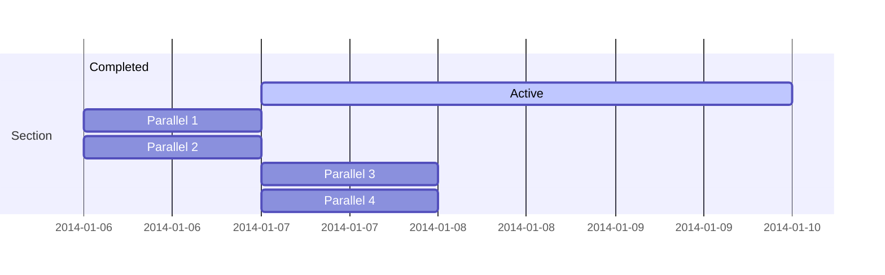

Easily manage your projects - create ideation mind maps, Gantt charts, todo lists, and more!

## Ideation

Hugo Blox supports a Markdown extension for mindmaps.

Simply insert a Markdown code block labelled as `markmap` and optionally set the height of the mindmap as shown in the example below.

Mindmaps can be created by simply writing the items as a Markdown list within the `markmap` code block, indenting each item to create as many sub-levels as you need:

<div class="highlight">
<pre class="chroma">
<code>
```markmap {height="200px"}
- Hugo Modules
  - Hugo Blox
  - blox-plugins-netlify
  - blox-plugins-netlify-cms
  - blox-plugins-reveal
```
</code>
</pre>
</div>

renders as

```markmap {height="200px"}
- Hugo Modules
  - Hugo Blox
  - blox-plugins-netlify
  - blox-plugins-netlify-cms
  - blox-plugins-reveal
```

## Diagrams

Hugo Blox supports the _Mermaid_ Markdown extension for diagrams.

An example **Gantt diagram**:

    ```mermaid
    gantt
    section Section
    Completed :done,    des1, 2014-01-06,2014-01-08
    Active        :active,  des2, 2014-01-07, 3d
    Parallel 1   :         des3, after des1, 1d
    Parallel 2   :         des4, after des1, 1d
    Parallel 3   :         des5, after des3, 1d
    Parallel 4   :         des6, after des4, 1d
    ```

renders as



## Todo lists

You can even write your todo lists in Markdown too:

```markdown
- [x] Write math example
  - [x] Write diagram example
- [ ] Do something else
```

renders as

- [x] Write math example
  - [x] Write diagram example
- [ ] Do something else

## Did you find this page helpful? Consider sharing it 🙌




 Terminal  
 Python  
 R


{}
A Markdown callout is useful for displaying notices, hints, or definitions to your readers.
{}

{}
Here's some important information...
{}

[I'm an external link](https://www.google.com)

[A project]()

[Scroll down to a page section with heading *Hi*](#hi)





<!DOCTYPE html>
<html lang="en">
<head>
  <meta charset="UTF-8">
  <meta name="viewport" content="width=device-width, initial-scale=1.0">
  <title>Typed.js Example</title>
  <!-- Include Typed.js library -->
  <script src="https://cdn.jsdelivr.net/npm/typed.js@2.0.12"></script>
</head>
<body>

  <span class="typed" data-typed-items="Designer, Developer, Freelancer, Photographer">Developer</span>

  <script>
    document.addEventListener('DOMContentLoaded', function() {
      var typedItems = document.querySelector('.typed').getAttribute('data-typed-items').split(',');
      new Typed('.typed', {
        strings: typedItems,
        typeSpeed: 100,
        backSpeed: 50,
        backDelay: 2000,
        loop: true
      });
    });
  </script>

</body>
</html>